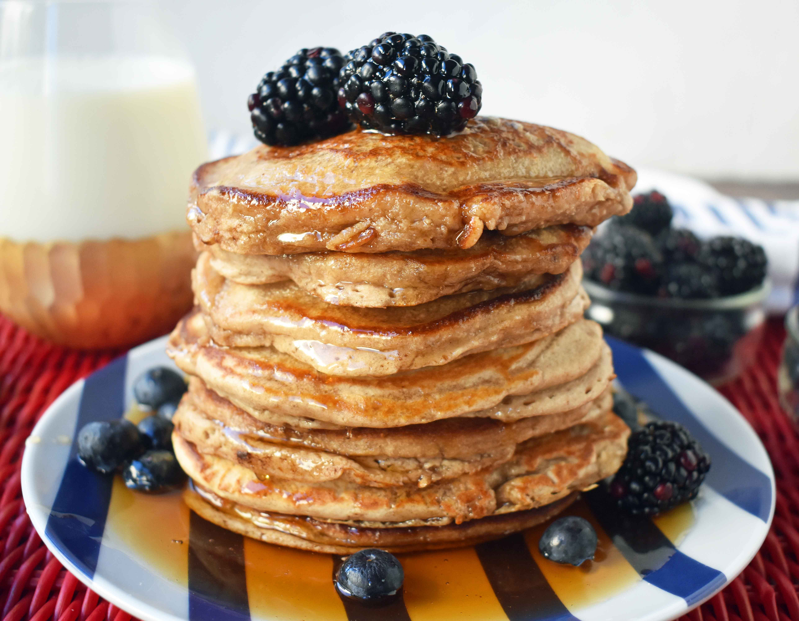

# Oatmeal Banana Pancakes

- Prep Time: 5 minutes
- Cook Time: 20 minutes
- Total Time: 25 minutes hour
- Servings: 4-6 pieces

## Ingredients

- Pancakes
    - ½ cup almond milk unsweetened
    - 2 Eggs
    - 1 Egg White
    - 1 Banana
    - 2 Tablespoons sugar
    - 1½ cups Rolled Oats
    - 2 teaspoons Baking Powder
    - ¼ - ½ teaspoon Salt
    - 1 Banana
- Optional toppings:
    - Fresh Berries
    - Real Maple Syrup
    - Chocolate Chips
    - Fresh Banana Slices
    - Sliced Almonds

## Instructions

- Pour almond milk, eggs, egg white, banana, sugar, rolled oats, baking powder and salt into a blender. Blend until smooth. If you don't have a blender, just mash the banana, throw everything into a bowl, and hope for the best.
- Heat skillet over medium heat. Once warmed, throw some butter or olive oil in the skillet. Pour pancake batter into skillet in a round circle. Cook on both sides until brown(ish).
- Repeat the step above until you don't have any bater left.
- Throw on some toppings and enjoy.

[Source](https://www.modernhoney.com/banana-oatmeal-pancakes/)
