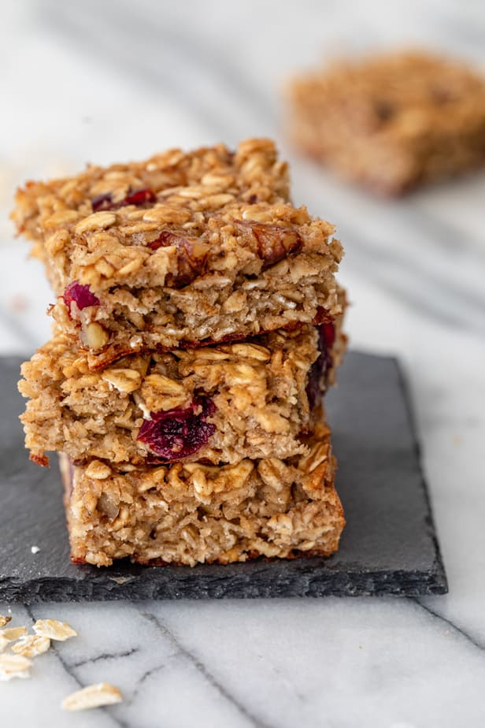

# Oatmeal Bars

- Prep Time: 5 minutes
- Cook Time: 35 minutes
- Set Time: 20 minutes
- Total Time: 1 hour
- Servings: 12-16 pieces

## Ingredients

- 2 cups old-fashioned rolled oats
- ½ cup cane sugar
- 1 ½ teaspoons baking powder
- ½ teaspoon salt
- ½ teaspoon cinnamon
- 2 eggs
- ½ cup almond milk
- ¼ cup applesauce
- 1 teaspoon vanilla extract
- ¼ cup walnuts/almonds/hazelnuts crushed
- ¼ cup dried cranberries

## Instructions

- Preheat oven to 180C°. Line an 8-inch square pan with parchment paper hanging over the edge.
In a medium bowl, combine the dry ingredients including the rolled oats, sugar, baking powder, salt, and cinnamon together in a bowl.
- In another large bowl, combine the wet ingredients including the eggs, milk, applesauce, and vanilla extract. Transfer the dry ingredients over the wet ingredients and set aside until flavors blend, about 20 minutes.
- Throw in the walnuts and cranberries, mix a bit, and spread combined mixture into prepared square pan.
- Bake in the preheated oven until edges are golden brown, about 30-35 minutes. Allow to cool on wire rack for 5 minutes before slicing. Cut into 12 to 16 bars.

[Source](https://feelgoodfoodie.net/recipe/oatmeal-breakfast-bars/)